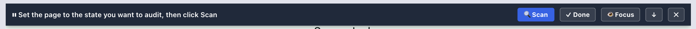
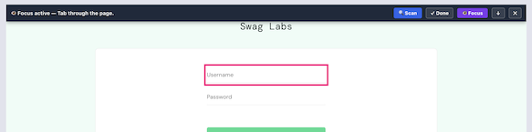
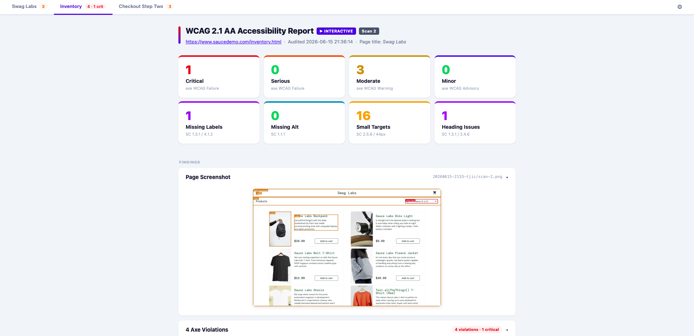
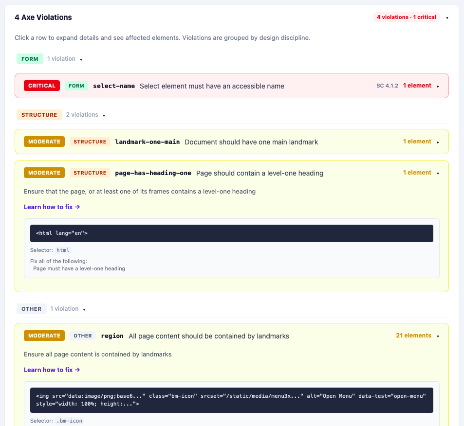
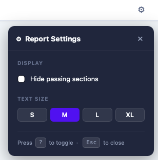

# Cypress AI Exploratory Automation

> Automated and interactive WCAG 2.1 AA accessibility auditing for Angular/Ionic SPAs, powered by Cypress and axe-core.


---

## Overview

This project audits Angular/Ionic sign-up and onboarding flows for accessibility violations without touching production code. It runs in two modes:

| Mode | Command | When to use |
|------|---------|-------------|
| **Automated** | `pnpm test:ai` | CI, quick baseline scan, pre-merge checks |
| **Automated + boxes** | `pnpm test:ai_boxes` | Same as above with violation bounding boxes annotated in the screenshot |
| **Interactive** | `pnpm test:ai_interactive` | Design reviews, multi-state walkthroughs, WCAG audits across page transitions |
| **Interactive + boxes** | `pnpm test:ai_interactive_boxes` | Interactive session with violation bounding boxes enabled |

Both modes produce the same output — self-contained HTML reports, a JSON data file, and viewport screenshots — grouped into a session folder so results never overwrite each other.

---

## Quick Start

### 1. Install dependencies

```bash
pnpm install
```

### 2. Configure your target URL (local only)

Create `cypress.env.json` at the project root (this file is gitignored):

```json
{ "BASE_URL": "https://your-staging-url.example.com" }
```

If this file is absent, the suite targets `https://www.saucedemo.com` as a smoke-test default.

### 3. Run

```bash
# Headless, single automated scan
pnpm test:ai

# Interactive via Cypress App (open-ended, multi-scan)
pnpm test:ai_interactive
```

---

## Modes

### Automated (`test:ai`)

```
Visit BASE_URL
  → wait for Angular to boot (up to 20 s)
  → scroll to bottom (flush lazy components)
  → scroll back to top
  → run WCAG audit
  → save report
```

No interaction required. Suitable for CI pipelines.

### Interactive (`test:ai_interactive`)

Opens the Cypress App and injects a control bar into the page under test.



The bar provides:

| Control | Action |
|---------|--------|
| **🔍 Scan** | Runs the WCAG audit against the current page state and saves a report, then loops back for the next scan |
| **👁 Focus** | Toggles a bright pink `:focus` outline on all AUT elements so you can walk the tab order visually without running a scan. The bar turns amber and shows a warning if focus escapes to the Cypress runner; click anywhere on the page to restore it. The outline is automatically stripped before each screenshot so it never appears in report images.  |
| **↑ / ↓** | Moves the bar between the top and bottom of the viewport |
| **⎯** | Minimizes the bar to a small pill in the bottom-right corner; click the pill to restore it |
| **✕** | Ends the session cleanly; all completed reports remain on disk |

Navigate the app between scans — each scan captures whatever page state is currently visible. There is no preset scan limit; click **✕** when finished.

---

## Output

All output for a session is grouped under a session folder named `YYYYMMDD-HHmm-xxxx` (generated at Cypress launch):

```
reports/ai-insights/
├── latest.html                      ← always points to the most recent session (bookmark this)
└── 20260612-1430-a3f9/              ← session folder
    ├── report.json                  ← full audit data for all scans
    ├── scan-1.png                   ← viewport screenshot (annotated if _boxes mode)
    ├── wcag-report-scan-1.html
    ├── scan-2.png
    ├── wcag-report-scan-2.html
    └── wcag-report-combined.html    ← tabbed view of all scans
```

`latest.html` is a full copy of the most recent session's combined report, overwritten after every scan. Bookmark it once — refresh after any run to see the newest output without navigating to the session folder.

### AI-Scan HTML report (`wcag-report-combined.html`)

Self-contained, no external dependencies, all CSS inlined. Includes:



**Score cards**
- axe-core violations by severity: critical / serious / moderate / minor
- Heuristic counts: missing labels, missing alt, small touch targets, heading issues

**Findings (collapsible sections)**
- Viewport screenshot (annotated with violation bounding boxes when `_boxes` mode is on)
- Axe-core violations — grouped by designer discipline (Visual / Interaction / Form / Structure) with impact-colored chips, discipline pills, and WCAG SC references

- Inputs missing accessible label
- Images missing alt text
- Small touch targets (< 44 × 44 px)
- Interactive elements with `tabindex="-1"` (removed from tab order)
- Elements with positive `tabindex` values (override natural tab order)

**Structure**
- Heading hierarchy (missing `h1`, multiple `h1`s, level skips)
- Landmark coverage (`<main>`, `<nav>`, `<header>`, `<footer>`)

**Reference**
- Element inventory (inputs, buttons, links, images, etc.)

**Report settings (⚙ gear button)**



- *Hide passing* — removes passing sections from the layout to focus on failures
- *Text size* — S / M / L / XL whole-page zoom

Section collapse state and settings persist in `localStorage` so the layout survives page refreshes.

**Combined view:** tabs across all scans in the session with violation badges. Each tab label is derived from the page's `<h1>` / `ion-title` / URL path. Regenerated after every scan.

### `report.json`

Machine-readable record of all `ai:log` events — structured axe violations, heuristic findings, screenshot steps, and errors. Can be consumed by external tools or a future AI analysis layer.

---

## Audit coverage

Each scan runs axe-core against the following rule sets:

| Tag | Standard |
|-----|----------|
| `wcag2a` | WCAG 2.0 Level A |
| `wcag2aa` | WCAG 2.0 Level AA |
| `wcag21a` | WCAG 2.1 Level A |
| `wcag21aa` | WCAG 2.1 Level AA |
| `best-practice` | axe best-practice rules |

In addition, the spec runs its own heuristic checks independently of axe:

| Heuristic | Standard |
|-----------|----------|
| Images missing `alt` text | SC 1.1.1 |
| Form inputs with no `<label>`, `aria-label`, or `aria-labelledby` | SC 1.3.1 / 4.1.2 |
| Interactive elements with `tabindex="-1"` (removed from tab order) | SC 2.1.1 |
| Elements with positive `tabindex` values (override natural tab order) | SC 1.3.2 / 2.4.3 |
| Touch targets below 44 × 44 px (warn) or 24 × 24 px (fail) | SC 2.5.8 |
| Heading hierarchy: missing `h1`, multiple `h1`s, level skips | SC 1.3.1 / 2.4.6 |
| Landmark region presence (`main`, `nav`, `header`, `footer`) | SC 1.3.6 / 2.4.1 |

---

## Project structure

```
cypress-ai-exploratory-automation/
├── cypress.config.js                  # Cypress config, session ID, all Node tasks
├── cypress.env.json                   # Local URL overrides — gitignored, not committed
├── package.json
│
├── cypress/
│   ├── e2e/
│   │   └── ai-driven/
│   │       └── ai-exploratory.cy.js  # Main spec (automated + interactive modes)
│   │
│   ├── support/
│   │   ├── e2e.js                    # Global hooks
│   │   ├── commands.js               # Custom Cypress commands
│   │   └── wcag-html-report.js       # HTML report generator
│   │
│   └── screenshots/                  # Cypress staging area (gitignored)
│       └── ai-analysis/
│           └── <SESSION_ID>/         # Moved to reports/ after each scan
│
└── reports/
    └── ai-insights/
        └── <SESSION_ID>/             # All session output colocated here
            ├── report.json
            ├── scan-N.png
            ├── wcag-report-scan-N.html
            └── wcag-report-combined.html
```

---

## Configuration reference

### Environment variables

Set via `cypress.env.json` (local) or `--env` flag (CLI):

| Variable | Default | Description |
|----------|---------|-------------|
| `BASE_URL` | `https://www.saucedemo.com` | Page to audit |
| `WCAG_INTERACTIVE` | `false` | Set `true` to enable interactive mode |
| `WCAG_HIGHLIGHT_BOXES` | `false` | Set `true` to annotate the screenshot with impact-colored bounding boxes and rule-ID labels over each violation node. Use the `_boxes` scripts as a one-shot alternative. |
| `WCAG_SCAN_TIMEOUT` | `600000` | Milliseconds to wait for a button click before timing out (interactive mode) |
| `SESSION_ID` | _(generated)_ | Set automatically by `setupNodeEvents`; do not override manually |

### `cypress.env.json` (local overrides)

```json
{
  "BASE_URL": "https://your-staging-url.example.com",
  "WCAG_SCAN_TIMEOUT": 1800000
}
```

This file is gitignored. Never commit target URLs that should remain private.

---

## Node tasks

Defined in `cypress.config.js`, called via `cy.task()` from the spec:

| Task | Purpose |
|------|---------|
| `ai:log` | Appends a structured event to the in-memory session store |
| `ai:save` | Writes `report.json` to the session report directory |
| `ai:moveScreenshot` | Moves the screenshot from Cypress's staging area into the session report directory |
| `ai:saveHtml` | Generates a per-scan HTML report |
| `ai:saveCombinedHtml` | Regenerates the tabbed combined report from all scans so far; also overwrites `reports/ai-insights/latest.html` |
| `ai:checkLink` | Node-side HEAD request for a single URL |
| `ai:checkLinks` | Parallel HEAD requests for a batch of URLs |

---

## Commands

```bash
pnpm test:ai                    # Headless automated scan
pnpm test:ai_boxes              # Headless scan with violation bounding boxes in screenshot
pnpm test:ai_interactive        # Interactive Cypress App session
pnpm test:ai_interactive_boxes  # Interactive session with violation bounding boxes enabled
pnpm cy:open                    # Open Cypress App (no WCAG env set)
pnpm cy:run                     # Full headless suite
```
